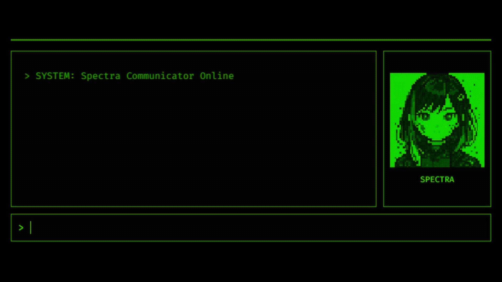

# Avatar UI Core

<div align="center">
  
**[📖 日本語版はこちら](README.ja.md)**

</div>

A classic terminal-style UI core. Provides an extensible project foundation from chat UI to CLI integration.




## Features

- **Terminal UI** - Classic green-on-black terminal interface
- **AI Avatar** - Pixel art avatar with synchronized speech animation
- **Typewriter Effect** - Real-time character-by-character display animation
- **Sound Effects** - Typing sound generation using Web Audio API
- **Complete Configuration Management** - All parameters managed via `.env` file

## Quick Start

### Requirements

- Python 3.8 or higher (Check version: `python --version` or `python3 --version`)
- pip (Python package manager, usually included with Python)
- Google AI Studio API Key ([Get it here](https://aistudio.google.com/app/apikey))

### Installation

#### 1. Clone the Repository

```bash
# Clone repository (or download and extract ZIP)
git clone https://github.com/yourusername/avatar-ui-core.git
cd avatar-ui-core
```

#### 2. Create Python Virtual Environment

Using a virtual environment keeps your system Python clean.

```bash
# Create virtual environment
python -m venv venv

# Activate virtual environment
# Linux/Mac:
source venv/bin/activate
# Windows (Command Prompt):
venv\Scripts\activate
# Windows (PowerShell):
venv\Scripts\Activate.ps1
```

When activated, you'll see `(venv)` in your terminal prompt.

#### 3. Install Required Packages

```bash
# Install packages from requirements.txt
pip install -r requirements.txt
```

### Configuration

#### 1. Prepare Environment File

```bash
# Copy template to create .env file
cp .env.example .env
# Windows: copy .env.example .env
```

#### 2. Set API Key

Open `.env` file in a text editor and configure required settings:

```bash
# Only required items need to be changed (others use default values)
GEMINI_API_KEY=paste_your_api_key_here
MODEL_NAME=gemini-2.0-flash  # or gemini-1.5-pro etc.
```

Other settings (avatar name, UI speed, sound effects) have default values and work out of the box. You can customize them later as needed.

**Important**: `.env` file contains sensitive information. Never commit it to Git.

### Launch

```bash
# Start the application
python app.py
```

On successful launch, you'll see:
```
 * Running on http://127.0.0.1:5000
```

Access the application at `http://localhost:5000` in your browser.

## Usage

### Basic Operations

1. **Send Message**: Type text in the input field at the bottom and press Enter
2. **Chat History**: View automatically scrolling conversation history
3. **Avatar**: Avatar animates while AI is responding

## Developer Information

### Project Structure

```
avatar-ui-core/
├── app.py                  # Flask application
├── settings.py             # Configuration management
├── requirements.txt        # Python dependencies
├── .env.example           # Environment template
├── static/
│   ├── css/
│   │   └── style.css      # UI styles
│   ├── js/
│   │   ├── app.js         # Main entry point
│   │   ├── chat.js        # Chat functionality
│   │   ├── animation.js   # Animation control
│   │   ├── sound.js       # Sound effects
│   │   └── settings.js    # Frontend configuration
│   └── images/
│       ├── idle.png       # Avatar (idle)
│       └── talk.png       # Avatar (talking)
└── templates/
    └── index.html         # HTML template
```

**Note**: The `docs/` folder contains development notes and assets, and does not affect application functionality.

### API Endpoints

| Endpoint | Method | Description | Parameters | Response |
|----------|--------|-------------|------------|----------|
| `/` | GET | Display main page | None | HTML |
| `/api/chat` | POST | Chat with AI | `{message: string}` | `{response: string}` or `{error: string}` |

### Customization

All settings can be adjusted in the `.env` file.

#### 1. Change Avatar

Replace image files:
- `static/images/idle.png`: Idle avatar (recommended: 140x140px)
- `static/images/talk.png`: Talking avatar (recommended: 140x140px)

#### 2. AI Personality

Edit these items in `.env` file:
```bash
AVATAR_NAME=Spectra
AVATAR_FULL_NAME=Spectra Communicator
SYSTEM_INSTRUCTION=You are Spectra, an AI assistant. Respond in a technical and direct style with concise answers.
```

#### 3. UI Behavior

Adjust various speeds in `.env` file:
```bash
# Typing speed (milliseconds, smaller = faster)
TYPEWRITER_DELAY_MS=30

# Mouth animation interval (milliseconds)
MOUTH_ANIMATION_INTERVAL_MS=100
```

#### 4. Sound Settings

Customize sound effects in `.env` file:
```bash
BEEP_FREQUENCY_HZ=600   # Pitch (Hz)
BEEP_VOLUME=0.1         # Volume (0.0-1.0)
BEEP_DURATION_MS=30     # Duration (milliseconds)
```

**Note**: Application restart required after configuration changes.

## Environment Variables

| Variable | Description | Default | Required |
|----------|-------------|---------|----------|
| `GEMINI_API_KEY` | Google Gemini API Key | - | ✅ |
| `MODEL_NAME` | Gemini model to use | gemini-2.0-flash | ✅ |
| **Server Settings** | | | |
| `SERVER_PORT` | Server port number | 5000 | |
| `DEBUG_MODE` | Enable debug mode | True | |
| **Avatar Settings** | | | |
| `AVATAR_NAME` | AI assistant name | Spectra | |
| `AVATAR_FULL_NAME` | AI assistant full name | Spectra Communicator | |
| `AVATAR_IMAGE_IDLE` | Idle avatar image | idle.png | |
| `AVATAR_IMAGE_TALK` | Talking avatar image | talk.png | |
| **AI Personality** | | | |
| `SYSTEM_INSTRUCTION` | AI personality and response style | Technical and concise responses | |
| **UI Settings** | | | |
| `TYPEWRITER_DELAY_MS` | Typewriter effect speed (ms) | 50 | |
| `MOUTH_ANIMATION_INTERVAL_MS` | Mouth animation interval (ms) | 150 | |
| **Sound Settings** | | | |
| `BEEP_FREQUENCY_HZ` | Beep frequency (Hz) | 800 | |
| `BEEP_DURATION_MS` | Beep duration (ms) | 50 | |
| `BEEP_VOLUME` | Beep volume (0.0-1.0) | 0.05 | |
| `BEEP_VOLUME_END` | Beep end volume | 0.01 | |

## Tech Stack

### Backend
- **Flask 3.0.0** - Web application framework
- **google-generativeai 0.8.3** - Gemini API integration
- **python-dotenv 1.0.0** - Environment variable management

### Frontend
- **ES6 Modules** - Modular JavaScript
- **Web Audio API** - Native browser sound generation
- **CSS3** - Modern styling
- **Fira Code** - Programming font

## ⚠️ Important Notes

- This project is provided as a naked UI foundation, with default implementation designed for single-user use.
- Sensitive information such as API keys is stored in `.env` and used only on the server side.
- Suitable for personal use and learning purposes as-is, but when deploying for public access:
  - User-specific configuration storage required
  - Authentication mechanisms must be added

## License

MIT License - See [LICENSE](LICENSE) file for details

## Credits

Developed by Sito Sikino

### Technologies Used
- Google Gemini API
- Flask Framework  
- Fira Code Font

---

**Note**: This project is created for entertainment and creative purposes. Please implement appropriate security measures when using in production environments.